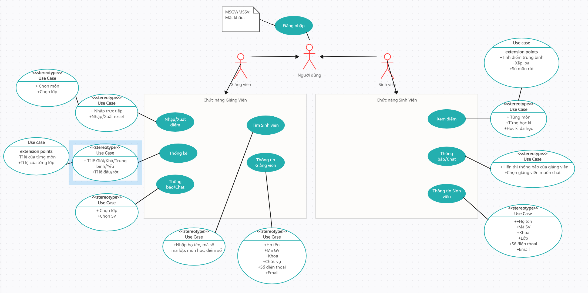

# ĐỒ ÁN: ỨNG DỤNG QUẢN LÝ ĐIỂM SINH VIÊN
**Nhóm 15:**

- Trần Thu Ngân - 22520937 ([Nene1724](https://github.com/Nene1724))
- Nguyễn Kim Khánh - 22520643 ([kikasssss](https://github.com/kikasssss))
- Lăng Cẩm Nhung - 22521057 ([CamNhungJB](https://github.com/CamNhungJB))
- Trần Anh Khôi - 22520701 ([anhkhoi312](https://github.com/anhkhoi312/))

**Giảng viên:** Trần Hồng Nghi 
## A. Mô tả đề tài

- Đăng nhập (Giảng viên, sinh viên) 
- Về phía người dùng là Sinh viên: Xem điểm, xem hạng, xếp loại 
- Về phía người dùng là Giảng viên: Nhập điểm, Đánh giá sinh viên, Tạo thông báo 
- Có chatbox giữa sinh viên và giảng viên
- Thông báo về khi giáo viên nhập điểm mới
### Công nghệ sử dụng:
- Winfrom
  
